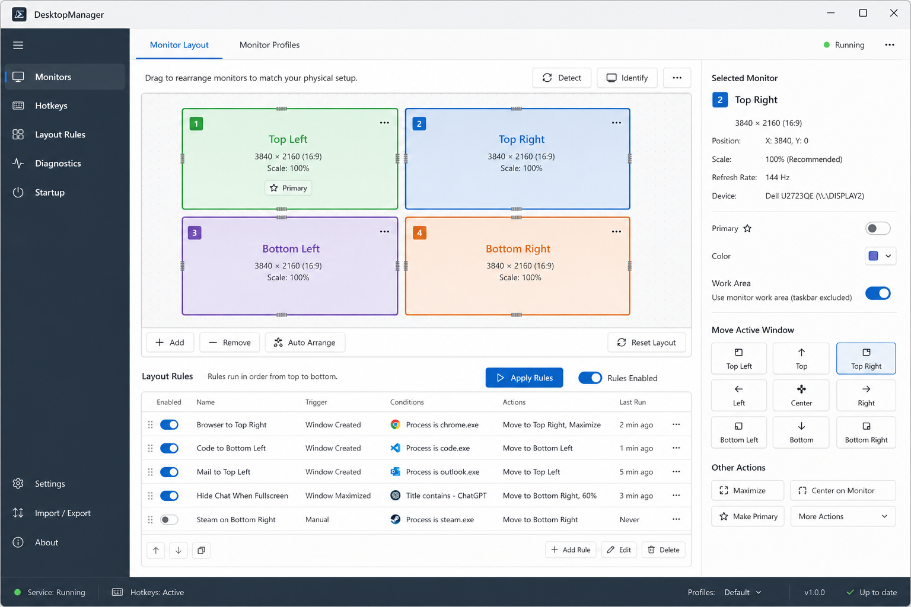
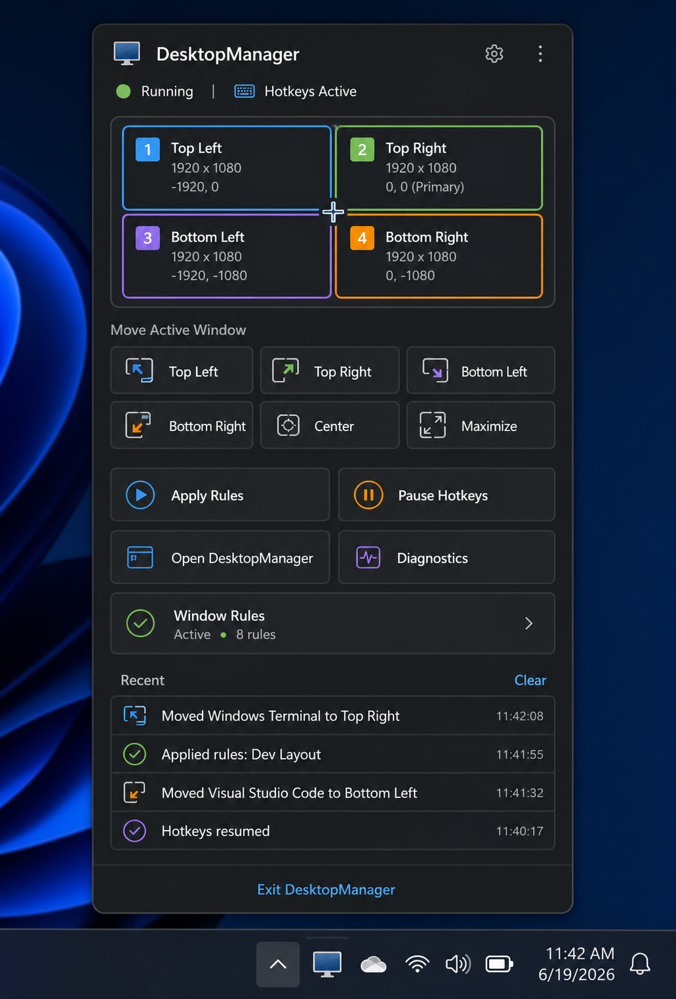
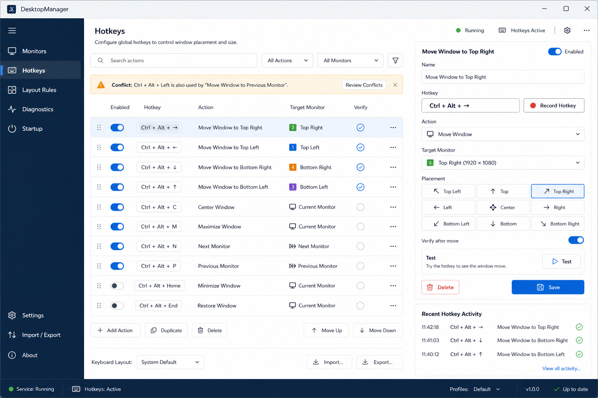
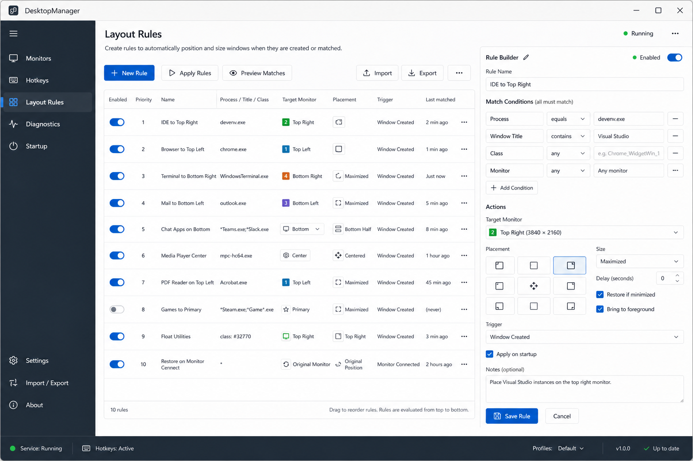
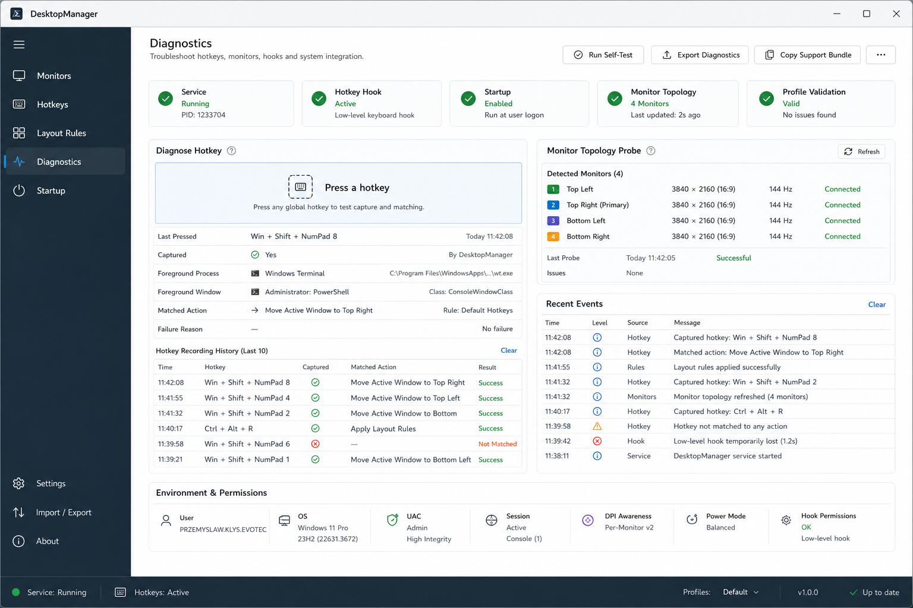
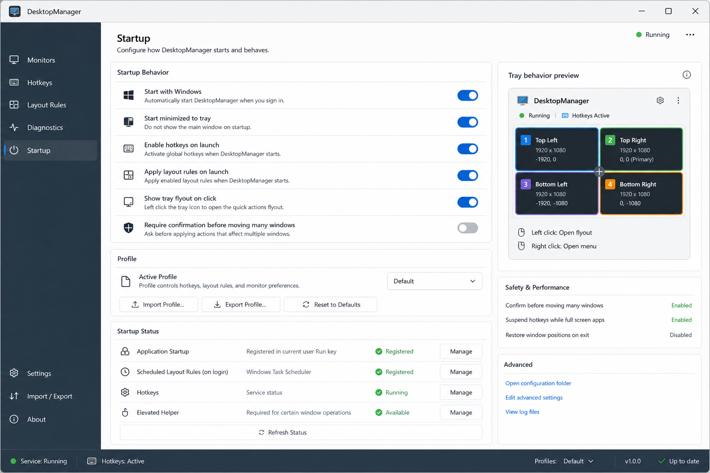
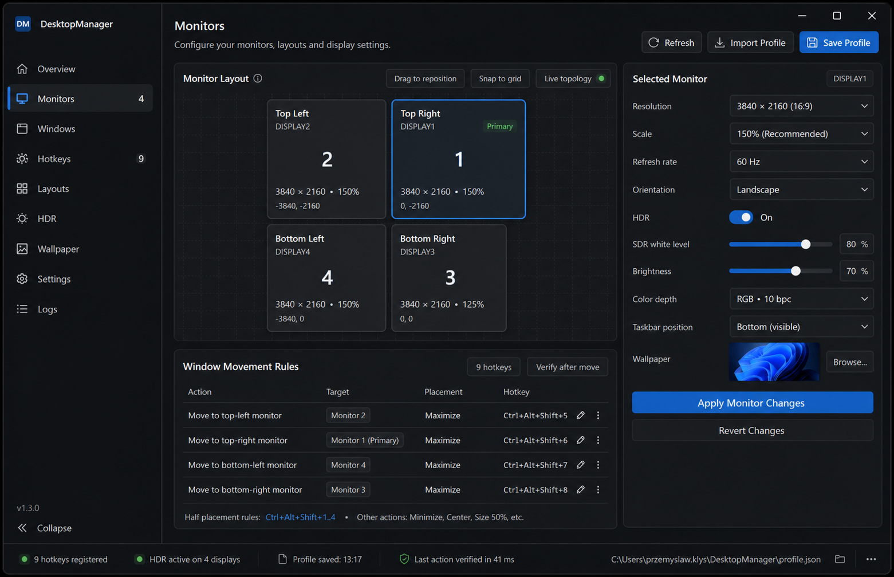

# DesktopManager App Design Plan

This document captures the image-model design direction for the DesktopManager desktop app and tray experience. The mockups are intentionally treated as design references, not exact pixel contracts.

## Design Goals

- Make monitor topology the center of the product, not a secondary settings field.
- Keep hotkey and rule editing fast enough for daily power-user use.
- Make tray interaction useful without opening the full app.
- Prefer clear operational surfaces over marketing-style presentation.
- Keep diagnostics first-class so broken hooks, permissions, and monitor identity issues can be understood quickly.

## Image Model References

| Surface | Mockup |
| --- | --- |
| Main app control center |  |
| Tray flyout |  |
| Hotkeys page |  |
| Layout rules page |  |
| Diagnostics page |  |
| Startup page |  |
| Earlier control-center exploration |  |

## Application Shell

The app should use a compact left navigation rail and keep all product surfaces in one window:

- `Monitors`
- `Hotkeys`
- `Layout Rules`
- `Diagnostics`
- `Startup`

The top area should include runtime status, hotkey status, active profile, and quick actions:

- `Apply Rules`
- `Pause Hotkeys` / `Resume Hotkeys`
- `Open Diagnostics`
- profile selector

The shell should avoid a landing page. Opening the app should land on the active management surface, with `Monitors` as the default.

## Monitors Page

The `Monitors` page is the primary workspace.

It should contain:

- a large topology canvas with physical monitor positions
- stable topology labels such as `Top Left`, `Top Right`, `Bottom Left`, `Bottom Right`
- resolution, DPI, primary, and connected status badges
- selected-monitor details panel
- quick `Move Active Window` controls
- buttons for `Center`, `Maximize`, `Restore`, and move-to-monitor
- visual indicators for disconnected or changed monitors
- a small topology refresh and diagnostics link

Expected behavior:

- Selecting a monitor highlights it in the topology and details panel.
- Topology labels should remain stable when device names change.
- Disconnected monitors should not disappear silently; they should show as unavailable when still referenced by rules or hotkeys.
- The active window movement commands should be testable directly from this page.

## Hotkeys Page

The `Hotkeys` page should be a real editor, not just a list of current bindings.

It should contain:

- searchable action list
- enabled toggle per action
- hotkey text and recorder control
- action type selector
- placement selector
- target monitor selector using topology names
- verification toggle
- conflict warning surface
- `Test`, `Save`, `Delete`, and `New Action`
- recent hotkey activity

Expected behavior:

- Recording a hotkey should show captured modifiers and key before saving.
- Conflicts should be detected before save.
- Testing a hotkey action should execute the same path as the runtime hotkey handler.
- Failed test results should link to `Diagnostics`.

## Layout Rules Page

The `Layout Rules` page should support DisplayFusion-style window placement rules.

It should contain:

- rule table with priority, enabled state, match summary, action summary, and last matched time
- `New Rule`, `Apply Rules`, and `Preview Matches`
- import/export profile actions
- rule builder for process name, window title, window class, and current monitor
- action builder for target monitor, placement, restore/maximize behavior, and delay
- apply-on-startup toggle
- safe delete and duplicate actions

Expected behavior:

- `Preview Matches` should show which currently open windows match each rule.
- `Apply Rules` should report moved, skipped, and failed windows.
- Rule priority should be explicit and reorderable.
- Rules should use stable monitor identity/topology, not fragile display numbers alone.

## Diagnostics Page

The `Diagnostics` page should make broken hotkeys and monitor issues explainable.

It should contain:

- runtime status strips for app, tray, hotkey hook, startup, profile validation, and monitor topology
- `Diagnose Hotkey` recorder panel
- last pressed hotkey, captured/not captured, foreground process, focused window, matched action, and failure reason
- monitor probe section
- recent events table
- `Run Self-Test`
- `Export Diagnostics`
- `Copy Support Bundle`

Expected behavior:

- The page should distinguish "not captured" from "captured but no action matched".
- Foreground-window filtering and elevated-window limitations should be visible.
- Profile validation errors should link directly to the affected hotkey or rule.
- Exported diagnostics should include profile, topology, recent events, and runtime status.

## Startup Page

The `Startup` page should collect lifecycle, tray, and profile behavior.

It should contain:

- `Start with Windows`
- `Start minimized to tray`
- `Enable hotkeys on launch`
- `Apply layout rules on launch`
- `Show tray flyout on click`
- `Require confirmation before moving many windows`
- active profile selector
- import/export/reset profile actions
- startup registration status
- tray behavior preview

Expected behavior:

- Startup registration should show the exact mechanism and status.
- Profile import should validate before replacing the active profile.
- Reset should offer scoped reset options: hotkeys only, rules only, or full profile.
- Settings that affect runtime behavior should apply immediately where possible.

## Tray Flyout

The tray should support two layers:

- left click: compact flyout for fast use
- right click: classic context menu fallback

The flyout should contain:

- status header: app running, hotkeys active/paused, active profile
- miniature monitor topology map
- quick `Move Active Window` buttons for each monitor
- `Center`, `Maximize`, and `Restore`
- `Apply Rules`
- `Pause Hotkeys` / `Resume Hotkeys`
- `Open DesktopManager`
- `Diagnostics`
- recent activity list

Expected behavior:

- Tray flyout commands should execute quickly and close only when appropriate.
- The flyout should show clear failure feedback when the active window cannot be moved.
- Right-click menu should keep reliable basics: open, pause/resume hotkeys, apply rules, reload profile, exit.

## Implementation Phases

### Phase 1: Structure

- Introduce shell navigation and page separation.
- Move current controls into `Monitors`, `Hotkeys`, `Layout Rules`, `Diagnostics`, and `Startup` views.
- Keep behavior equivalent while improving layout.

### Phase 2: Monitor Canvas

- Build a topology canvas from current monitor topology data.
- Add selectable monitor elements and topology labels.
- Wire `Move Active Window` commands to selected monitor actions.

### Phase 3: Editors

- Replace ad-hoc editing with dedicated hotkey and rule editor components.
- Add conflict detection and profile validation feedback.
- Add rule preview and apply result summaries.

### Phase 4: Tray Flyout

- Add a real tray flyout window.
- Keep the right-click menu as fallback.
- Add quick movement, rule execution, and diagnostics commands.

### Phase 5: Diagnostics

- Expand hotkey diagnostics into a structured live panel.
- Add support bundle export.
- Add monitor identity/topology warnings and profile validation links.

## Open Design Decisions

- Whether the app should default to a dark, light, or system-following theme.
- Whether topology labels should be user-overridable.
- Whether rule priority should use drag-and-drop, up/down buttons, or both.
- Whether profile import/export should remain JSON-only or include a friendlier package format later.
- Whether tray flyout should pin open during multi-window placement sessions.
