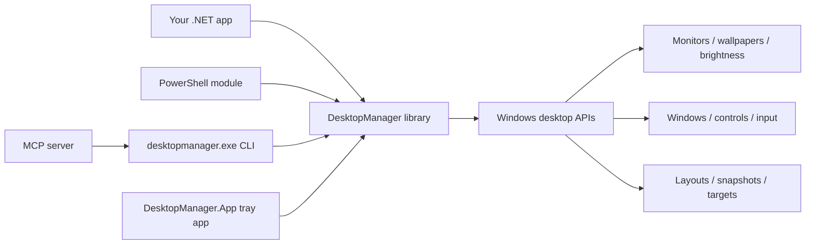
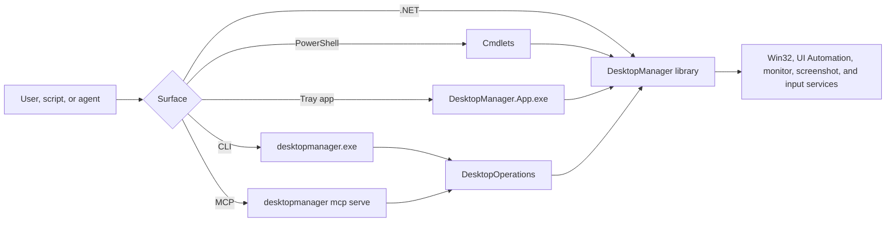

# DesktopManager - C# Library and PowerShell Module

DesktopManager is available as NuGet from the Nuget Gallery.

[](https://www.nuget.org/packages/DesktopManager)
[](https://www.nuget.org/packages/DesktopManager)

You can also download it from PowerShell Gallery

[](https://www.powershellgallery.com/packages/DesktopManager)
[](https://www.powershellgallery.com/packages/DesktopManager)
[](https://www.powershellgallery.com/packages/DesktopManager)

[](https://www.powershellgallery.com/packages/DesktopManager)
[](https://github.com/EvotecIT/DesktopManager)
[](https://github.com/EvotecIT/DesktopManager)
[](https://github.com/EvotecIT/DesktopManager)
[](https://codecov.io/gh/EvotecIT/DesktopManager)

If you would like to contact me you can do so via Twitter or LinkedIn.

[](https://twitter.com/PrzemyslawKlys)
[](https://evotec.xyz/hub)
[](https://www.linkedin.com/in/pklys)
[](https://evo.yt/discord)
[](https://www.threads.net/@przemyslaw.klys)


## What it's all about


**DesktopManager** is a C# library and PowerShell module that allows to play with desktop settings. It allows to get information about monitors, display devices, wallpapers and set wallpapers. There are 2 ways to use:
- **C# Library** - use it in your projects
- **PowerShell Module** - use it in your scripts

It has following features:
- Get information about monitors
- Get information about display devices
- Get information about wallpapers
- Set wallpapers
- Get/Set desktop background color
- Get/Set monitor position
- Get/Set window position
- Get/Set window state (minimize, maximize, restore)
 - Capture desktop screenshots from all monitors, a single monitor or a custom region
- Manage monitor brightness
- Start/Stop/Advance wallpaper slideshows
- Track wallpaper history
- Adjust monitor resolution, orientation and DPI scaling
- Move monitors around the virtual desktop
- Save and restore window layouts
- Snap or move windows between monitors
- Subscribe to resolution, orientation or display changes
- Keep inactive windows awake using periodic input
- Manage keep-alive sessions for windows

Additional operator-focused docs for the newer CLI and MCP surfaces:

- [Docs/DesktopManager.Cli.md](Docs/DesktopManager.Cli.md)
- [Docs/DesktopManager.Mcp.md](Docs/DesktopManager.Mcp.md)
- [Docs/DesktopManager.Architecture.md](Docs/DesktopManager.Architecture.md)
- [Docs/DesktopManager.AutomationBasics.md](Docs/DesktopManager.AutomationBasics.md)
- [Docs/DesktopManager.Plugin.md](Docs/DesktopManager.Plugin.md)
- [.agents/skills/desktopmanager-operator/SKILL.md](.agents/skills/desktopmanager-operator/SKILL.md)
- [.agents/skills/desktopmanager-build/SKILL.md](.agents/skills/desktopmanager-build/SKILL.md)

## Which Surface Should You Use?

| Surface | Best for | Typical entrypoint |
| ------- | -------- | ------------------ |
| C# library | Embedding DesktopManager into your own .NET app or service | `DesktopManager.dll` |
| PowerShell module | Scripts, operators, admin workflows, repeatable task automation | `Install-Module DesktopManager` |
| CLI executable | Manual use, shell automation, JSON output, and MCP hosting | `desktopmanager.exe` |
| MCP server | Agent-driven automation over stdio with an inspect-first safety model | `desktopmanager mcp serve` |
| Windows tray app | Daily hotkeys, monitor bindings, HDR controls, tray runtime, and per-user startup | `DesktopManager.App.exe` |

## How It Fits Together

DesktopManager now has one shared core and several operator-facing surfaces on top of it.



If you want the fuller component and request-flow diagrams, see [Docs/DesktopManager.Architecture.md](Docs/DesktopManager.Architecture.md).

The practical way to think about this:

- use the library when DesktopManager is part of your own application
- use PowerShell when you want scriptable admin/operator automation
- use the CLI when you want a human-friendly or JSON-friendly command surface
- use MCP when an agent should inspect first and mutate only through an explicit server session

## Common Entry Points

| Goal | Recommended entrypoint |
| ---- | ---------------------- |
| Add DesktopManager features to your own code | Reference the `DesktopManager` NuGet package |
| Run manual desktop operations from a terminal | `desktopmanager.exe` |
| Run DesktopManager every day from the tray | `DesktopManager.App.exe` or the DesktopManager MSI |
| Use it from PowerShell scripts | `DesktopManager` PowerShell module |
| Connect an agent/tooling layer | `desktopmanager mcp serve` |
| Understand the overall wiring | [Docs/DesktopManager.Architecture.md](Docs/DesktopManager.Architecture.md) |

## Request Flow at a Glance



The important part is that CLI, MCP, and PowerShell are meant to stay aligned by reusing the same shared C# behavior rather than inventing separate desktop logic in each surface.


### Available PowerShell Cmdlets

| Cmdlet | Description |
| ------ | ----------- |
| Get-DesktopMonitor | Retrieve monitor information with filtering options |
| Get-DesktopWallpaper | Get current wallpaper path for monitors |
| Set-DesktopWallpaper | Apply wallpaper from path, URL or stream |
| Get-DesktopWallpaperHistory | List stored wallpaper history entries |
| Set-DesktopWallpaperHistory | Update or clear wallpaper history file |
| Get-DesktopSlideshow | Inspect slideshow images, state, options and tick interval |
| Set-DesktopSlideshowOptions | Update slideshow shuffle behavior and tick interval |
| Start-DesktopSlideshow | Begin wallpaper slideshow across monitors |
| Stop-DesktopSlideshow | Stop currently running slideshow |
| Step-DesktopSlideshow | Move slideshow forward or backward |
| Get-DesktopBackgroundColor | Read current desktop background color |
| Set-DesktopBackgroundColor | Change desktop background color |
| Get-DesktopBrightness | Read monitor brightness level |
| Set-DesktopBrightness | Set monitor brightness level |
| Set-DesktopPosition | Configure monitor coordinates |
| Set-DesktopResolution | Change monitor resolution or orientation |
| Set-DesktopDpiScaling | Adjust DPI scaling percentage |
| Set-DefaultAudioDevice | Set the default audio playback device |
| Get-LogonWallpaper | Get the lock screen wallpaper path |
| Set-LogonWallpaper | Set the lock screen wallpaper |
| Set-TaskbarPosition | Move or hide the taskbar |
| Invoke-DesktopMouseMove | Move the mouse cursor |
| Invoke-DesktopMouseClick | Simulate a mouse click |
| Invoke-DesktopMouseScroll | Scroll the mouse wheel |
| Invoke-DesktopScreenshot | Capture monitor or region screenshots |
| Get-DesktopWindow | Enumerate visible windows |
| Get-DesktopWindowGeometry | Return outer-window and client-area geometry for matched windows |
| Get-DesktopWindowControl | Enumerate Win32 or UIA window controls |
| Get-DesktopWindowControlDiagnostic | Explain Win32 vs UIA control discovery and actionability |
| Get-DesktopWindowProcessInfo | Return process details for matched windows |
| Get-DesktopWindowTarget | List saved window-relative targets or resolve one against live windows |
| Get-DesktopControlTarget | List saved control targets or resolve one against live windows |
| Get-DesktopHostedSessionDiagnostic | Read the latest hosted-session typing diagnostic artifact or a specific one |
| Invoke-DesktopControlClick | Click a matched control using shared control action routing |
| Invoke-DesktopWindowClick | Click a window-relative point or saved window target |
| Invoke-DesktopWindowDrag | Drag between window-relative points or saved targets |
| Invoke-DesktopWindowScroll | Scroll at a window-relative point or saved target |
| Send-DesktopControlKey | Send keys to a matched control without reimplementing key routing |
| Set-DesktopControlTarget | Save a reusable control selector profile |
| Set-DesktopControlText | Write text directly to a specific control |
| Set-DesktopWindow | Move, resize or control windows |
| Set-DesktopWindowSnap | Snap window to common positions |
| Set-DesktopWindowTarget | Save a reusable window-relative point target |
| Set-DesktopWindowText | Paste or type text into a window |
| Wait-DesktopWindow | Wait for a window to appear |
| Wait-DesktopWindowControl | Wait for a control to appear |
| Test-DesktopWindow | Verify that a window exists or matches the active window |
| Test-DesktopWindowControl | Verify that a control exists |
| Start-DesktopWindowKeepAlive | Send periodic input to keep a window awake |
| Stop-DesktopWindowKeepAlive | Stop sending keep-alive input |
| Get-DesktopWindowKeepAlive | List windows with active keep-alive |
| Save-DesktopWindowLayout | Save current window layout to file |
| Restore-DesktopWindowLayout | Restore saved window layout |
| Register-DesktopMonitorEvent | Subscribe to display configuration changes |
| Register-DesktopOrientationEvent | Subscribe to orientation changes |
| Register-DesktopResolutionEvent | Subscribe to resolution changes |

### Cmdlet to C# method map

The table below shows the most relevant API methods behind each PowerShell cmdlet.

| Cmdlet | Main C# methods |
| ------ | --------------- |
| Get-DesktopMonitor | `Monitors.GetMonitors` |
| Get-DesktopWallpaper | `Monitors.GetWallpaper` or `Monitor.GetWallpaper` |
| Set-DesktopWallpaper | `Monitors.SetWallpaper`, `Monitors.SetWallpaperFromUrl` |
| Get-DesktopWallpaperHistory | `WallpaperHistory.GetHistory` |
| Set-DesktopWallpaperHistory | `WallpaperHistory.SetHistory` |
| Get-DesktopSlideshow | `Monitors.GetWallpaperSlideshow` |
| Set-DesktopSlideshowOptions | `Monitors.SetWallpaperSlideshowOptions` |
| Start-DesktopSlideshow | `Monitors.StartWallpaperSlideshow` |
| Stop-DesktopSlideshow | `Monitors.StopWallpaperSlideshow` |
| Step-DesktopSlideshow | `Monitors.AdvanceWallpaperSlide` |
| Get-DesktopBackgroundColor | `Monitors.GetBackgroundColor` |
| Set-DesktopBackgroundColor | `Monitors.SetBackgroundColor` |
| Get-DesktopBrightness | `Monitors.GetMonitorBrightness` |
| Set-DesktopBrightness | `Monitors.SetMonitorBrightness` |
| Set-DesktopPosition | `Monitor.SetMonitorPosition` or `Monitors.SetMonitorPosition` |
| Set-DesktopResolution | `Monitors.SetMonitorResolution`, `Monitors.SetMonitorOrientation` |
| Set-DesktopDpiScaling | `Monitors.SetMonitorDpiScaling` |
| Set-DefaultAudioDevice | `AudioService.SetDefaultAudioDevice` |
| Get-LogonWallpaper | `Monitors.GetLogonWallpaper` |
| Set-LogonWallpaper | `Monitors.SetLogonWallpaper` |
| Set-TaskbarPosition | `TaskbarService.SetTaskbarPosition` / `SetTaskbarVisibility` |
| Invoke-DesktopMouseMove | `WindowManager.MoveMouse` |
| Invoke-DesktopMouseClick | `WindowManager.ClickMouse` |
| Invoke-DesktopMouseScroll | `WindowManager.ScrollMouse` |
| Invoke-DesktopScreenshot | `ScreenshotService.CaptureScreen`, `ScreenshotService.CaptureRegion` |
| Get-DesktopWindow | `WindowManager.GetWindows` / `GetWindowsForProcess` |
| Get-DesktopWindowGeometry | `DesktopAutomationService.GetWindowGeometry` |
| Get-DesktopWindowControl | `DesktopAutomationService.GetControls` |
| Get-DesktopWindowControlDiagnostic | `DesktopAutomationService.GetControlDiagnostics` / `GetControlTargetDiagnostics` |
| Get-DesktopWindowProcessInfo | `WindowManager.GetWindowProcessInfo` |
| Get-DesktopWindowTarget | `DesktopAutomationService.ListWindowTargets`, `GetWindowTarget`, `ResolveWindowTargets` |
| Get-DesktopControlTarget | `DesktopAutomationService.ListControlTargets`, `GetControlTarget`, `ResolveControlTargets` |
| Invoke-DesktopControlClick | `DesktopAutomationService.ClickControls` / `ClickControlTarget` |
| Invoke-DesktopWindowClick | `DesktopAutomationService.ClickWindowPoint` / `ClickWindowTarget` |
| Invoke-DesktopWindowDrag | `DesktopAutomationService.DragWindowPoints` / `DragWindowTargets` |
| Invoke-DesktopWindowScroll | `DesktopAutomationService.ScrollWindowPoint` / `ScrollWindowTarget` |
| Send-DesktopControlKey | `DesktopAutomationService.SendControlKeys` / `SendControlTargetKeys` |
| Set-DesktopControlTarget | `DesktopAutomationService.SaveControlTarget` |
| Set-DesktopControlText | `DesktopAutomationService.SetControlText` |
| Set-DesktopWindow | `WindowManager.SetWindowPosition`, `MoveWindowToMonitor`, etc. |
| Set-DesktopWindowSnap | `WindowManager.SnapWindow` |
| Set-DesktopWindowTarget | `DesktopAutomationService.SaveWindowTarget` |
| Set-DesktopWindowText | `WindowManager.TypeText`, `WindowManager.PasteText`, `WindowInputService` |
| Wait-DesktopWindow | `DesktopAutomationService.WaitForWindows` |
| Wait-DesktopWindowControl | `DesktopAutomationService.WaitForControls` |
| Test-DesktopWindow | `DesktopAutomationService.WindowExists` / `ActiveWindowMatches` |
| Test-DesktopWindowControl | `DesktopAutomationService.ControlExists` |
| Start-DesktopWindowKeepAlive | `WindowKeepAlive.Start` |
| Stop-DesktopWindowKeepAlive | `WindowKeepAlive.Stop` or `StopAll` |
| Get-DesktopWindowKeepAlive | `WindowKeepAlive.ActiveHandles` |
| Save-DesktopWindowLayout | `WindowManager.SaveLayout` |
| Restore-DesktopWindowLayout | `WindowManager.LoadLayout` |
| Register-DesktopMonitorEvent | `MonitorWatcher.DisplaySettingsChanged` |
| Register-DesktopOrientationEvent | `MonitorWatcher.OrientationChanged` |
| Register-DesktopResolutionEvent | `MonitorWatcher.ResolutionChanged` |

### Installation

For using in PowerShell you can install it from PowerShell Gallery

```powershell
Install-Module DesktopManager -Force -Verbose
```

For the daily Windows tray app, use the DesktopManager MSI release artifact when available. The installer creates a Start Menu shortcut, and the app's Startup toggle registers the current user for minimized tray startup.

From source, the app and MSI are built through PowerForge:

```powershell
.\Build\Build-DesktopManagerApp.ps1
.\Build\Build-DesktopManagerApp-MSI.ps1
msiexec.exe /i .\Artefacts\PowerForge\Msi\DesktopManager.App\win-x64\net10.0-windows10.0.19041.0\PortableCompat\output\DesktopManager.msi
```

### Verified mutation examples

When you want more than "the call did not throw", prefer `-Verify` together with `-PassThru` so the cmdlet returns the observed postcondition.

```powershell
# Verify a window move against the observed geometry
Set-DesktopWindow -Name "*Visual Studio Code*" -Left 0 -Top 0 -Width 1600 -Height 1200 -Verify -PassThru

# Verify exact text after a control text update
Set-DesktopControlText -Control $ctrl -Text "Hello world" -Verify -PassThru

# Verify the observed check state
Set-DesktopControlCheck -Control $checkbox -Check $true -Verify -PassThru

# Return a structured record after a control click
Invoke-DesktopControlClick -Control $button -PassThru

# Return a structured record after sending keys
Send-DesktopControlKey -Control $editor -Keys @([DesktopManager.VirtualKey]::VK_RETURN) -PassThru
```

Verification behavior is action-aware:

- window mutations verify geometry, state, topmost, close, or foreground conditions when those postconditions are meaningful
- `Set-DesktopControlText -Verify` verifies the observed text/value when the control can be re-queried
- `Set-DesktopControlCheck -Verify` verifies the observed check state
- control click/key actions return honest presence and foreground evidence when exact semantic verification would be misleading

### Testing notes

UI-impacting tests are opt-in to avoid opening windows or changing the desktop during local development. Use the environment variables below to control behavior:

- `RUN_UI_TESTS=true` (or `DESKTOPMANAGER_RUN_UI_TESTS=true`) enables the top-level UI test pack.
- `RUN_OWNED_WINDOW_UI_TESTS=true` (or `DESKTOPMANAGER_RUN_OWNED_WINDOW_UI_TESTS=true`) enables owned-window UI tests that use repo-created harness windows.
- `RUN_DESTRUCTIVE_UI_TESTS=true` (or `DESKTOPMANAGER_RUN_DESTRUCTIVE_UI_TESTS=true`) enables owned-window mutation tests such as move, resize, hide, snap, and transparency changes against repo-created harness windows.
- `RUN_FOREGROUND_UI_TESTS=true` (or `DESKTOPMANAGER_RUN_FOREGROUND_UI_TESTS=true`) enables tests that intentionally steal foreground focus, even when they only target repo-created harness windows.
- `RUN_SYSTEM_UI_TESTS=true` (or `DESKTOPMANAGER_RUN_SYSTEM_UI_TESTS=true`) enables system-wide desktop changes such as wallpapers, brightness, resolution, and other monitor-level mutations that can affect your current session.
- `RUN_EXTERNAL_UI_TESTS=true` (or `DESKTOPMANAGER_RUN_EXTERNAL_UI_TESTS=true`) enables live external-application UI tests and MCP end-to-end harnesses that launch real desktop apps.
- `RUN_EXPERIMENTAL_UI_TESTS=true` (or `DESKTOPMANAGER_RUN_EXPERIMENTAL_UI_TESTS=true`) enables experimental live UI harnesses that are useful for manual validation but are not part of the stable regression pack.
- `SKIP_UI_TESTS=true` (or `DESKTOPMANAGER_SKIP_UI_TESTS=true`) forces UI tests to skip, even if enabled elsewhere.

The gates compose intentionally:

| Gate | What it permits | Typical impact |
| ---- | --------------- | -------------- |
| `RUN_UI_TESTS` | Top-level UI pack enablement only | Low |
| `RUN_OWNED_WINDOW_UI_TESTS` | Repo-owned WinForms/WPF harness windows | Low to medium |
| `RUN_DESTRUCTIVE_UI_TESTS` | Mutations against owned harness windows | Medium to high |
| `RUN_FOREGROUND_UI_TESTS` | Tests that intentionally take foreground focus | Medium to high |
| `RUN_SYSTEM_UI_TESTS` | System-wide desktop changes | High |
| `RUN_EXTERNAL_UI_TESTS` | Launching real desktop apps | Medium to high |
| `RUN_EXPERIMENTAL_UI_TESTS` | Experimental live harnesses | Varies |

```powershell
# Run owned-window UI tests
$env:RUN_UI_TESTS = "true"
$env:RUN_OWNED_WINDOW_UI_TESTS = "true"

# Run repo-owned window mutation tests
$env:RUN_DESTRUCTIVE_UI_TESTS = "true"

# Run tests that intentionally steal foreground focus
$env:RUN_FOREGROUND_UI_TESTS = "true"

# Run system-wide desktop mutations
$env:RUN_SYSTEM_UI_TESTS = "true"

# Run live external-application harnesses
$env:RUN_EXTERNAL_UI_TESTS = "true"

# Run experimental live UI harnesses
$env:RUN_EXPERIMENTAL_UI_TESTS = "true"

# Force skip
$env:SKIP_UI_TESTS = "true"

# Run the repo-owned window mutation slice
dotnet test Sources/DesktopManager.Tests/DesktopManager.Tests.csproj -f net8.0-windows10.0.19041.0 --no-build --filter "WindowPositionTests|WindowStateHelpersTests|WindowVisibilityTests|WindowTransparencyTests|WindowStyleModificationTests|WindowLayoutTests"

# Run the foreground-window slice
dotnet test Sources/DesktopManager.Tests/DesktopManager.Tests.csproj -f net8.0-windows10.0.19041.0 --no-build --filter "DesktopAutomationAssertionTests|WindowManagerFilterTests|WindowTopMostActivationTests"

# Run the live MCP desktop pack backed by the repo-owned DesktopManager.TestApp harness
dotnet test Sources/DesktopManager.Tests/DesktopManager.Tests.csproj -f net8.0-windows10.0.19041.0 --no-build --filter "McpServer_TestApp"
```

When the hosted-session or experimental live harnesses skip because focus or discoverability never stabilize, they now leave structured diagnostics and artifacts rather than failing silently. See [Docs/Build.Runbook.md](Docs/Build.Runbook.md) for the hosted-session artifact flow and gate guidance.

### Usage

#### Example in C#

Full exaple can be found in `DesktopManager.Example` project, as helper methods are requried to display data properly.

```csharp
Monitors monitor = new Monitors();
var getMonitors = monitor.GetMonitors();

Helpers.AddLine("Number of monitors", getMonitors.Count);
Helpers.ShowPropertiesTable("GetMonitors() ", getMonitors);

var getMonitorsConnected = monitor.GetMonitorsConnected();
Helpers.AddLine("Number of monitors (connected):", getMonitorsConnected.Count);
Helpers.ShowPropertiesTable("GetMonitorsConnected() ", getMonitorsConnected);

var listDisplayDevices = monitor.DisplayDevicesAll();
Console.WriteLine("Count DisplayDevicesAll: " + listDisplayDevices.Count);
Helpers.ShowPropertiesTable("DisplayDevicesAll()", listDisplayDevices);

Console.WriteLine("======");

var getDisplayDevices = monitor.DisplayDevicesConnected();
Console.WriteLine("Count DisplayDevicesConnected: " + getDisplayDevices.Count);
Helpers.ShowPropertiesTable("DisplayDevicesConnected()", getDisplayDevices);

Console.WriteLine("======");

Console.WriteLine("Wallpaper Position (only first monitor): " + monitor.GetWallpaperPosition());

foreach (var device in monitor.GetMonitorsConnected()) {
    Console.WriteLine("3==================================");
    Console.WriteLine("MonitorID: " + device.DeviceId);
    Console.WriteLine("Wallpaper Path: " + device.GetWallpaper());
    var rect1 = device.GetMonitorPosition();
    Console.WriteLine("RECT1: {0} {1} {2} {3}", rect1.Left, rect1.Top, rect1.Right, rect1.Bottom);

    // Get and display monitor position
    var position = monitor.GetMonitorPosition(device.DeviceId);
    Helpers.ShowPropertiesTable($"Position before move {device.DeviceId}", position);

    var position1 = device.GetMonitorPosition();
    Helpers.ShowPropertiesTable($"Position before move {device.DeviceId}", position1);

}

// Set monitor position
monitor.SetMonitorPosition(@"\\?\DISPLAY#GSM5BBF#5&22b00b5d&0&UID4352#{e6f07b5f-ee97-4a90-b076-33f57bf4eaa7}", -3840, 500, 0, 2160);

// Get and display monitor position
var testPosition = monitor.GetMonitorPosition(@"\\?\DISPLAY#GSM5BBF#5&22b00b5d&0&UID4352#{e6f07b5f-ee97-4a90-b076-33f57bf4eaa7}");
Helpers.ShowPropertiesTable("Position after move", testPosition);

Thread.Sleep(5000);

// Set monitor position
monitor.SetMonitorPosition(@"\\?\DISPLAY#GSM5BBF#5&22b00b5d&0&UID4352#{e6f07b5f-ee97-4a90-b076-33f57bf4eaa7}", -3840, 0, 0, 2160);

// Get and display monitor position
testPosition = monitor.GetMonitorPosition(@"\\?\DISPLAY#GSM5BBF#5&22b00b5d&0&UID4352#{e6f07b5f-ee97-4a90-b076-33f57bf4eaa7}");
Helpers.ShowPropertiesTable("Position after move", testPosition);

monitor.SetWallpaper(1, @"C:\Users\przemyslaw.klys\Downloads\CleanupMonster2.jpg");
```

#### Example in C# - Getting/Setting Window Position

```csharp
var manager = new WindowManager();
manager.GetWindows
manager.SetWindowPosition
manager.CloseWindow
manager.MinimizeWindow
manager.MaximizeWindow
manager.RestoreWindow
```

### Platform notes

When retrieving a window's style the library uses a helper method that calls
`GetWindowLong` on 32-bit processes and `GetWindowLongPtr` on 64-bit ones. The
method returns an `IntPtr`, so callers should convert the value to the
appropriate numeric type.

#### Example in PowerShell - Getting Monitor Information

```powershell
Get-DesktopMonitor | Format-Table

Get-DesktopWallpaper -Index 0

Set-DesktopWallpaper -Index 1 -WallpaperPath "C:\Support\GitHub\ImagePlayground\Sources\ImagePlayground.Examples\bin\Debug\net7.0\Images\KulekWSluchawkach.jpg" -Position Fit
Set-DesktopWallpaper -Index 0 -WallpaperPath "C:\Users\przemyslaw.klys\Downloads\IMG_4820.jpg"
Set-DesktopBackgroundColor -Color 0x0000FF
Get-DesktopBackgroundColor
```

#### Example in PowerShell - Wallpaper Slideshow

```powershell
Start-DesktopSlideshow -ImagePath 'C:\Wallpapers\img1.jpg','C:\Wallpapers\img2.jpg' -Shuffle -SlideshowTick 300000
Get-DesktopSlideshow
Set-DesktopSlideshowOptions -NoShuffle -SlideshowTick 600000
Step-DesktopSlideshow -Direction Forward
Stop-DesktopSlideshow
```

```powershell
$Desktop1 = Get-DesktopMonitor
$Desktop1 | Format-Table

$Desktop2 = Get-DesktopMonitor -ConnectedOnly
$Desktop2 | Format-Table

$Desktop3 = Get-DesktopMonitor -PrimaryOnly
$Desktop3 | Format-Table

$Desktop4 = Get-DesktopMonitor -Index 1
$Desktop4 | Format-Table

$Desktop5 = Get-DesktopMonitor -DeviceName "\\.\DISPLAY2"
$Desktop5 | Format-Table
```

#### Example in PowerShell - Setting Monitor Position

```powershell
$Desktop2 = Get-DesktopMonitor -ConnectedOnly
$Desktop2 | Format-Table

Set-DesktopPosition -Index 0 -Left -3840 -Top 0 -Right 0 -Bottom 1660 -WhatIf
Set-DesktopPosition -Index 1 -Left 0 -Top 0 -Right 3840 -Bottom 2160 -WhatIf


### Example in PowerShell - Getting/Setting Window Position

```powershell
Get-DesktopWindow | Format-Table *
```

```powershell
$np = Start-Process notepad -PassThru
Get-DesktopWindow -ProcessId $np.Id
$np | Stop-Process
```


```powershell
Set-DesktopWindow -Name '*Zadanie - Notepad' -Height 800 -Width 1200 -Left 100
Set-DesktopWindow -Name '*Zadanie - Notepad' -State Maximize
```

```powershell
Set-DesktopWindowText -Name '*Notepad*' -Text 'Hello world'
```

```powershell
# Send Ctrl+S to Notepad
$notepad = Get-DesktopWindow -Name '*Notepad*'
Invoke-DesktopKeyPress -Window $notepad -Keys @(
    [DesktopManager.VirtualKey]::VK_CONTROL,
    [DesktopManager.VirtualKey]::VK_S
)
# See Examples/KeyboardActions.ps1
```

### Example in PowerShell - Activating and Setting Window Top-Most

```powershell
Set-DesktopWindow -Name '*Notepad*' -TopMost -Activate
```

#### Example in C# - Activating and Setting Window Top-Most

```csharp
var manager = new WindowManager();
var window = manager.GetWindows().First();
manager.SetWindowTopMost(window, true);
manager.ActivateWindow(window);
#### Example in PowerShell - Monitoring Display Changes

Use `Register-DesktopMonitorEvent` to react when monitors are plugged in or the display configuration changes.

```powershell
Register-DesktopMonitorEvent -Duration 30 -Action { Write-Host 'Display settings changed' }
```

Use `Register-DesktopOrientationEvent` or `Register-DesktopResolutionEvent` to handle orientation or resolution changes individually.

```powershell
Register-DesktopResolutionEvent -Duration 30 -Action { Write-Host 'Resolution changed' }
Register-DesktopOrientationEvent -Duration 30 -Action { Write-Host 'Orientation changed' }
```

#### Example in C# - Monitoring Display Changes

Applications can subscribe to the `MonitorWatcher.DisplaySettingsChanged` event.

```csharp
MonitorWatcherExample.Run(TimeSpan.FromSeconds(30));
```

#### Example in PowerShell - Saving and Restoring Window Layout

```powershell
Save-DesktopWindowLayout -Path './layout.json'
# ... move windows around ...
Restore-DesktopWindowLayout -Path './layout.json' -Validate
```

#### Example in C# - Saving and Restoring Window Layout

```csharp
var manager = new WindowManager();
manager.SaveLayout("layout.json");
// ... move windows around ...
manager.LoadLayout("layout.json", validate: true);
```

#### Examples in PowerShell - Window Keep-Alive Cmdlets

```powershell
# Keep Notepad alive for one minute
Start-DesktopWindowKeepAlive -Name '*Notepad*' -Interval 00:01:00

# List active sessions
Get-DesktopWindowKeepAlive

# Stop the session
Stop-DesktopWindowKeepAlive -Name '*Notepad*'
```

```powershell
# Keep Notepad and Calculator alive
Start-DesktopWindowKeepAlive -Name '*Notepad*'
Start-DesktopWindowKeepAlive -Name '*Calculator*' -Interval 00:00:30
Start-Sleep -Seconds 5
Get-DesktopWindowKeepAlive | Format-Table Title, Handle
Stop-DesktopWindowKeepAlive -All
```

```powershell
# Monitor RDP windows
Start-DesktopWindowKeepAlive -Name '*RDP*' -Interval 00:00:30
1..3 | ForEach-Object {
    Start-Sleep -Seconds 10
    Get-DesktopWindowKeepAlive | ForEach-Object { "Active: $($_.Title)" }
}
Stop-DesktopWindowKeepAlive -Name '*RDP*'
```

#### Examples in C# - Window Keep-Alive

```csharp
var manager = new WindowManager();
var notepad = manager.GetWindows("*Notepad*").FirstOrDefault();
if (notepad != null) {
    WindowKeepAlive.Instance.Start(notepad, TimeSpan.FromMinutes(1));
}
```

```csharp
foreach (var window in new WindowManager().GetWindows("*Chrome*")) {
    WindowKeepAlive.Instance.Start(window, TimeSpan.FromSeconds(30));
}
```

```csharp
foreach (var handle in WindowKeepAlive.Instance.ActiveHandles) {
    Console.WriteLine($"Keeping {handle} alive");
}
WindowKeepAlive.Instance.StopAll();
```

### C# API Highlights

DesktopManager ships as a .NET library targeting `net472`, `netstandard2.0`, `net8.0-windows10.0.19041.0`, and `net10.0-windows10.0.19041.0`. The main entry points are:

- `Monitors` for monitor enumeration, wallpaper management, brightness, resolution, orientation and slideshow control.
- `WindowManager` for window enumeration, positioning, resizing and layout persistence.
- `MonitorWatcher` to receive events when display settings change.
- `ScreenshotService` to capture the desktop or custom regions.
